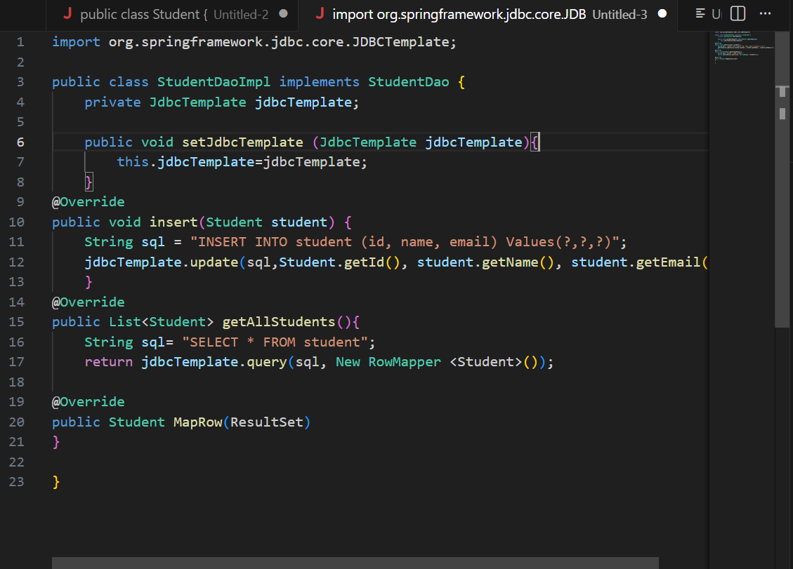
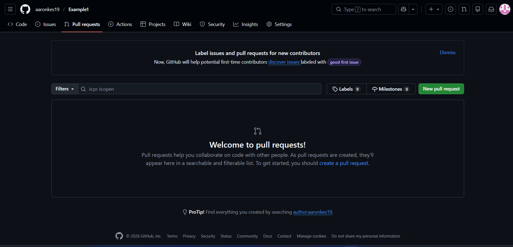

# Project Title

## 📌 Project Description
This project is a simple application that demonstrates how to use Git and GitHub for version control.  
It includes file creation, commits, and pull request workflow.

The purpose of this project is to:
- Practice cloning a repository
- Add and update files
- Commit changes
- Push to GitHub
- Create pull requests

---

## 🚀 Steps Followed

1. Cloned the repository from GitHub:
   ```
   git clone https://github.com/username/repository-name.git
   ```

2. Navigated into the project folder:
   ```
   cd repository-name
   ```

3. Created and updated project files.

4. Added files to Git:
   ```
   git add .
   ```

5. Committed changes:
   ```
   git commit -m "Updated README with project description"
   ```

6. Pushed changes to GitHub:
   ```
   git push origin main
   ```

7. Created a Pull Request (if working on a branch).

---

## 📝 Commit History Screenshot

Below is the screenshot of the commit history:



---

## 🔀 Pull Request Screenshot

Below is the screenshot of the pull request:



---

## 📂 Project Structure

```
repository-name/
│── README.md
│── index.html
│── screenshots/
    │── commit-history.png
    │── pull-request.png
```

---

## ✅ Conclusion

This project demonstrates the basic Git workflow including:
- Cloning a repository
- Adding and committing changes
- Pushing to GitHub
- Creating a pull request
